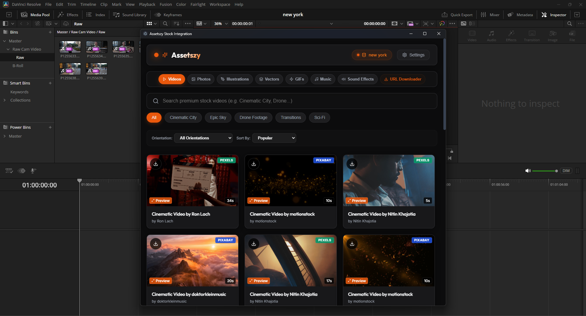
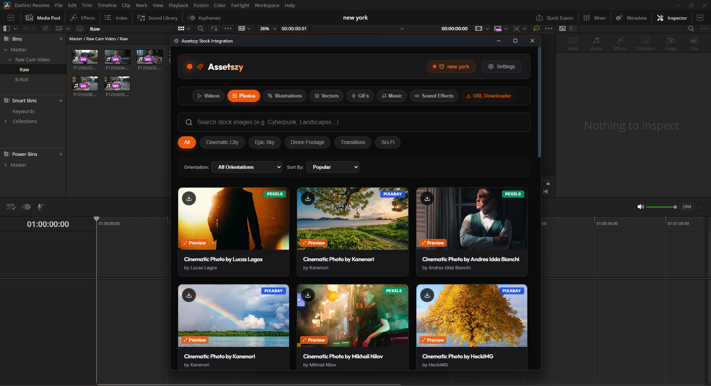
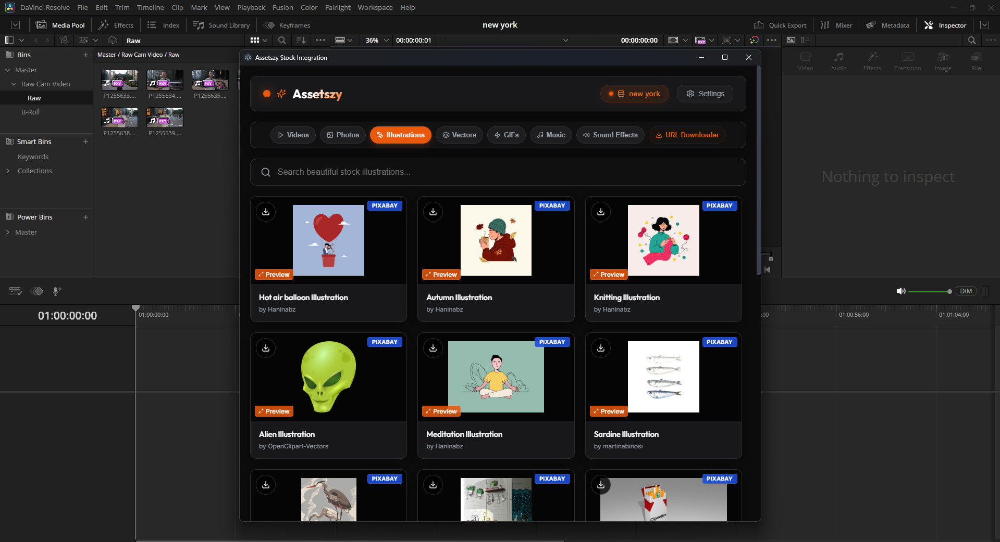
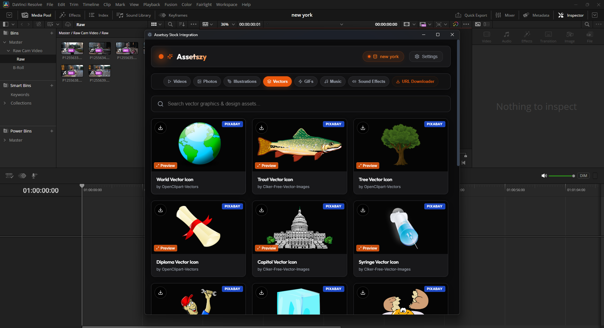
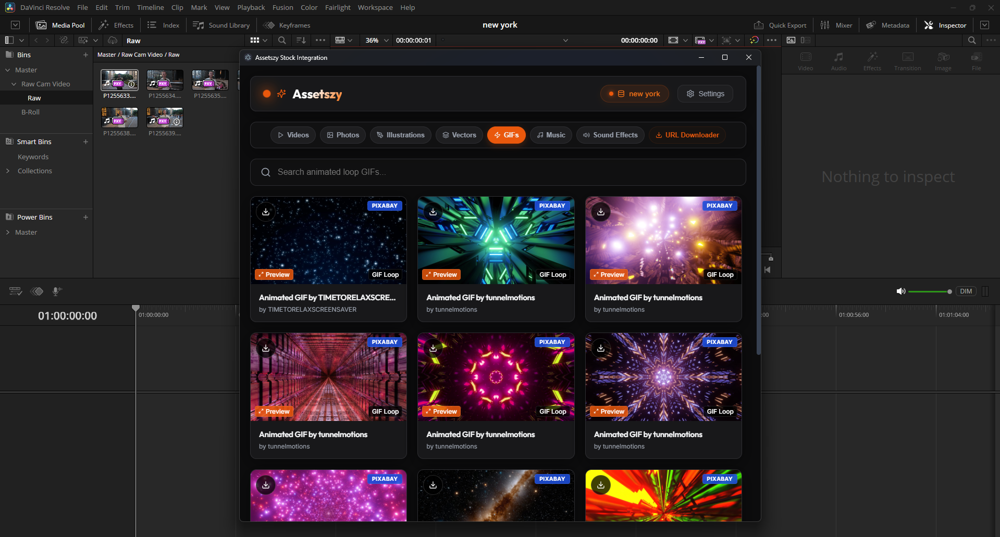
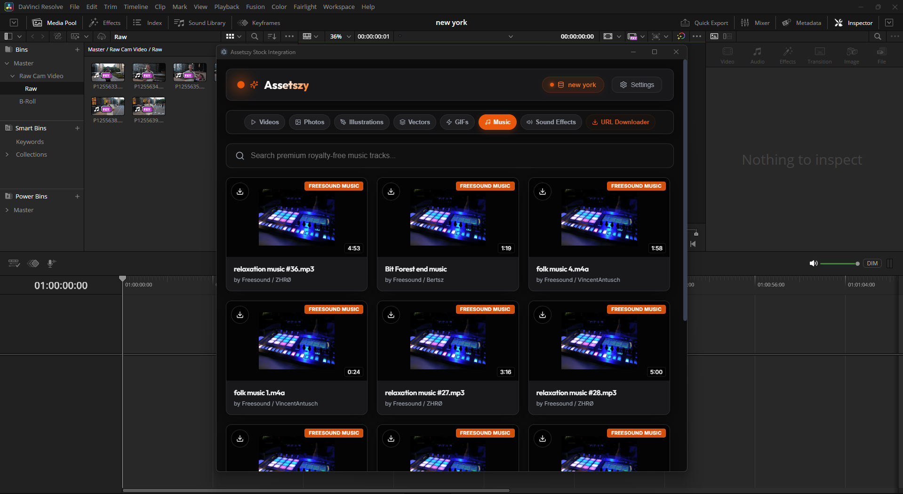
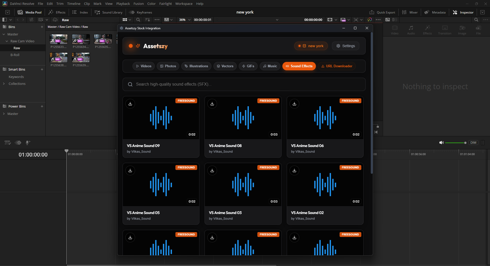
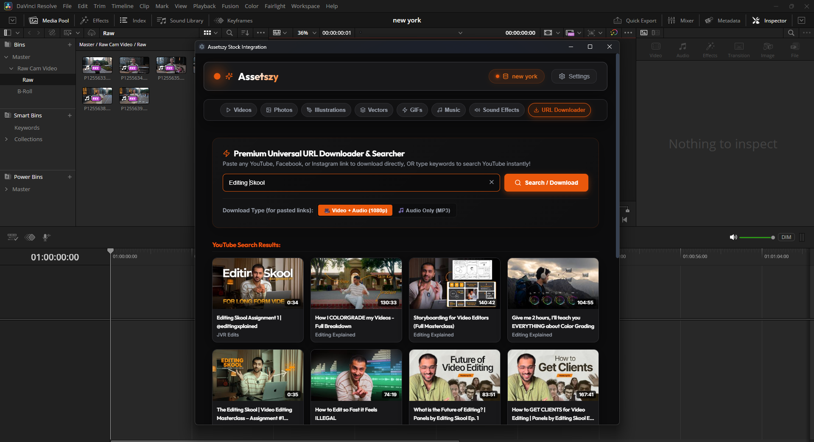
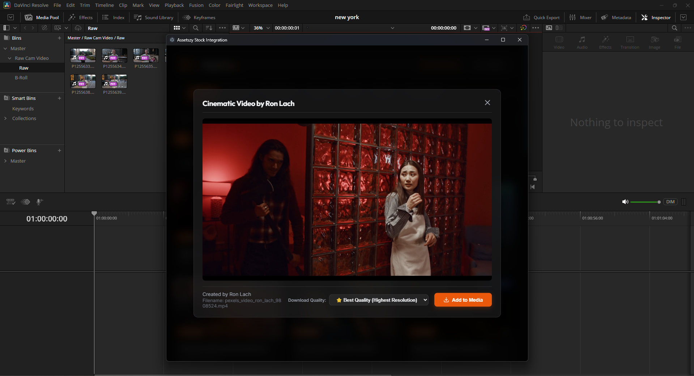
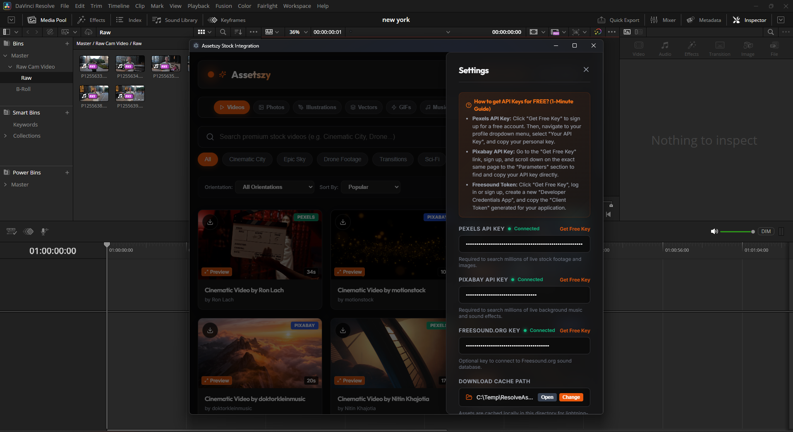

# <div align="center">🌌 Assetszy — Premium DaVinci Resolve Stock Integration</div>

<div align="center">
  
  
  
</div>

<br />

Assetszy is an enterprise-grade Workflow Integration Plugin for **DaVinci Resolve Studio**. It bridges the gap between editing and asset sourcing by letting you search, preview, and instantly import premium stock videos, photos, transparent vectors, audio, SFX, and YouTube downloads directly to your active media pool and timeline with a single click.

---

## 📺 Video Demonstration
Watch Assetszy in action inside DaVinci Resolve:

<div align="center">
  <a href="https://github.com/user-attachments/assets/8ffb987b-dca0-49f7-944a-ec4dd2e9fd6f" target="_blank">
    
  </a>
</div>

---

## 🎨 Feature Screenshots
Explore the beautiful dark glassmorphic user interface:

<div align="center">
  <table>
    <tr>
      <td width="50%">
        <p align="center"><b>1. HD Stock Video Library</b></p>
        
      </td>
      <td width="50%">
        <p align="center"><b>2. Premium Stock Photos</b></p>
        
      </td>
    </tr>
    <tr>
      <td width="50%">
        <p align="center"><b>3. Premium Illustrations</b></p>
        
      </td>
      <td width="50%">
        <p align="center"><b>4. Transparent Vectors</b></p>
        
      </td>
    </tr>
    <tr>
      <td width="50%">
        <p align="center"><b>5. Rich GIF Integration</b></p>
        
      </td>
      <td width="50%">
        <p align="center"><b>6. Royalty-Free Music Library</b></p>
        
      </td>
    </tr>
    <tr>
      <td width="50%">
        <p align="center"><b>7. Free Sound Effects (SFX)</b></p>
        
      </td>
      <td width="50%">
        <p align="center"><b>8. Zero-Setup Video Downloader</b></p>
        
      </td>
    </tr>
    <tr>
      <td width="50%">
        <p align="center"><b>9. Instant Import in Media Pool</b></p>
        
      </td>
      <td width="50%">
        <p align="center"><b>10. API Configuration & Settings</b></p>
        
      </td>
    </tr>
  </table>
</div>

---

## ✨ Key Features
* 📹 **Multi-Source Video & Photo Search:** Real-time preview of cinematic footage and high-res photos.
* 🎨 **Transparent Vectors & Illustrations:** Pre-filtered background-free PNG assets ideal for graphic overlays.
* 🎵 **Royalty-Free Music & SFX Search:** Real-time audio waveform visualizer and rotating vinyl disk player to test music assets before importing.
* 📥 **Zero-Setup YouTube Downloader:** Instantly fetch and resolve YouTube clips or high-fidelity audio streams.
* ⚡ **Seamless Workflow Ingest:** Imports directly into whatever Resolve page you are working on, with no UI interruptions.

---

## 🚀 Installation Instructions

### 💻 Windows Installation
1. **Download** the single-file installer: [**`Assetszy_Setup.exe`**](https://github.com/islamifty/assetszy-release/raw/main/Assetszy_Setup.exe)
2. **Double-click** the setup file.
3. Click **Install** (it automatically locates the Resolve directory).
4. Restart **DaVinci Resolve Studio**.
5. Launch from: **Workspace > Workflow Integrations > Assetszy**.

### 🍎 macOS Installation
Apple Gatekeeper security restricts unsigned apps. Follow these steps to bypass:
1. **Download** the zip bundle: [**`Assetszy_Mac.zip`**](https://github.com/islamifty/assetszy-release/raw/main/Assetszy_Mac.zip)
2. **Extract** the files to a folder.
3. **Double-click** on **`install-mac.command`** (this opens Terminal, deploys all assets, and automatically runs `xattr` to clear security blocks).
4. Restart **DaVinci Resolve Studio**.
5. Launch from: **Workspace > Workflow Integrations > Assetszy**.

---

## 🛠️ Manual Security Bypass (macOS)
If you manually copied the folder and macOS displays the *"WorkflowIntegration cannot be opened because developer cannot be verified"* warning, run this command in terminal:
```bash
xattr -cr "$HOME/Library/Application Support/Blackmagic Design/DaVinci Resolve/Workflow Integration Plugins/com.assetszy.resolve.plugin"
```

---

## 📄 License & Intellectual Property
All rights reserved. Proprietary software developed for DaVinci Resolve Studio integrations. Unauthorized distribution, decompiling, or modification of the source process is strictly prohibited under international copyright laws.
